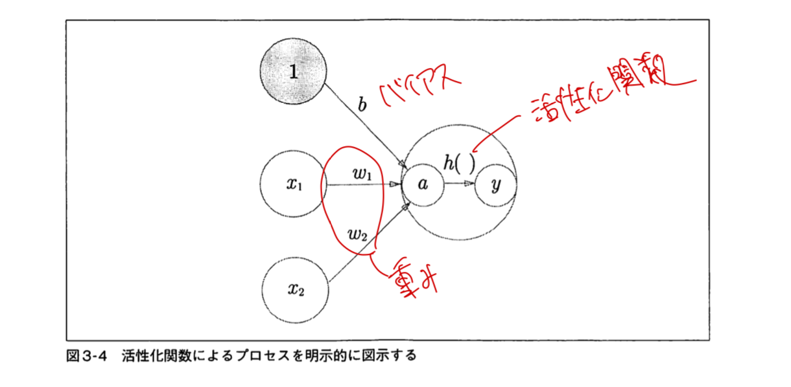
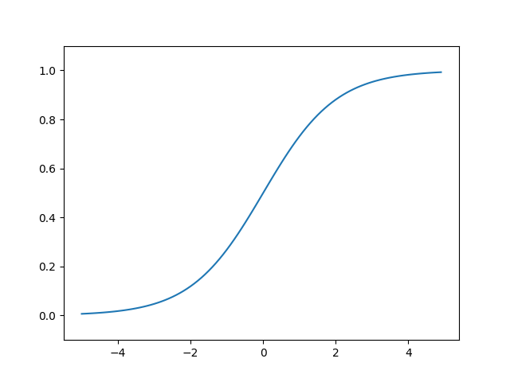
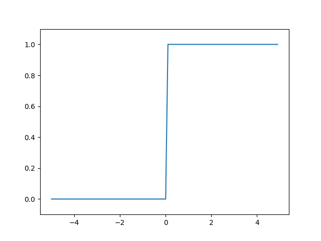
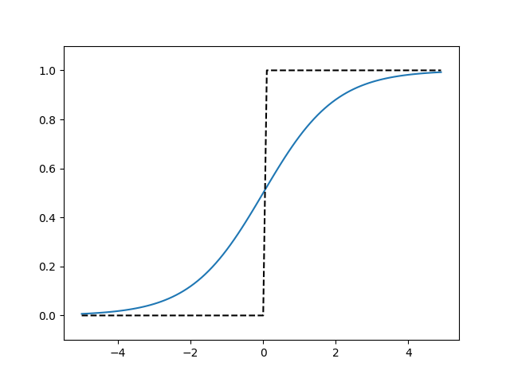
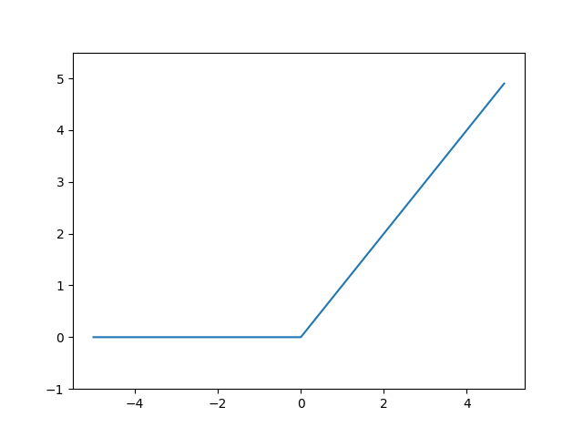
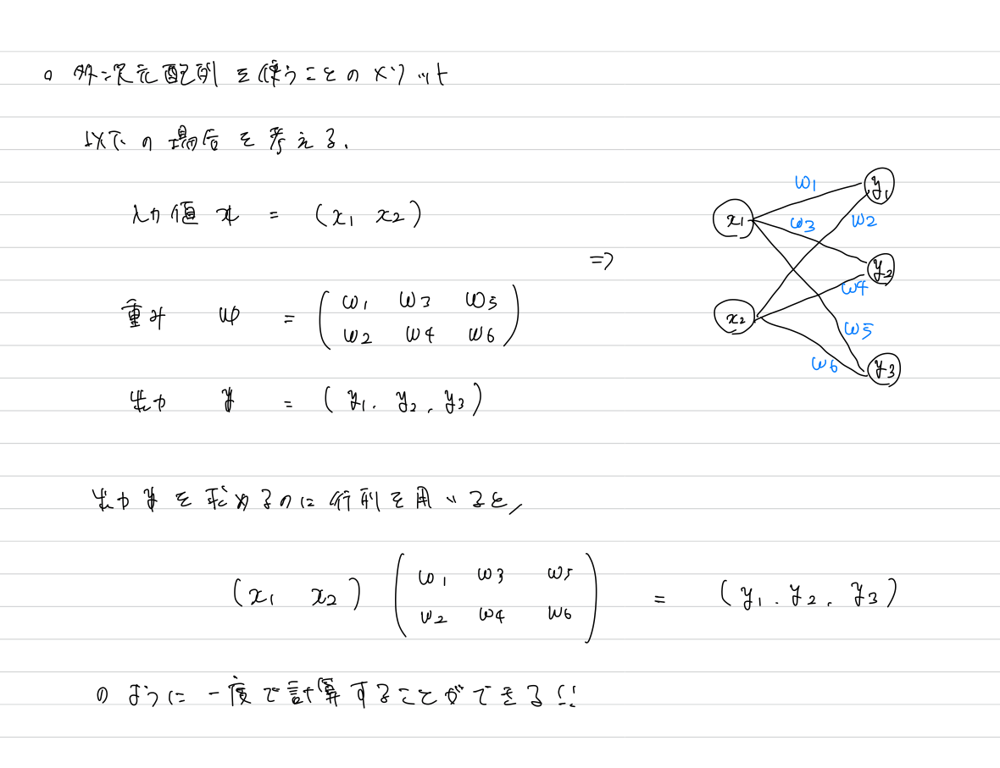
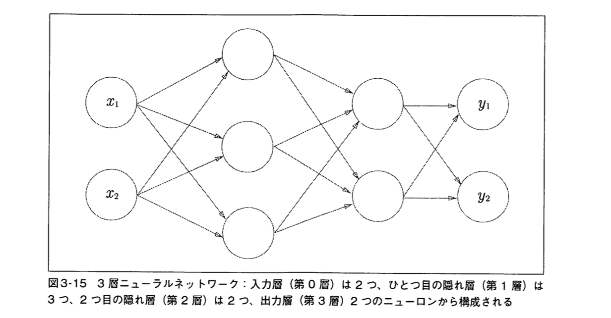
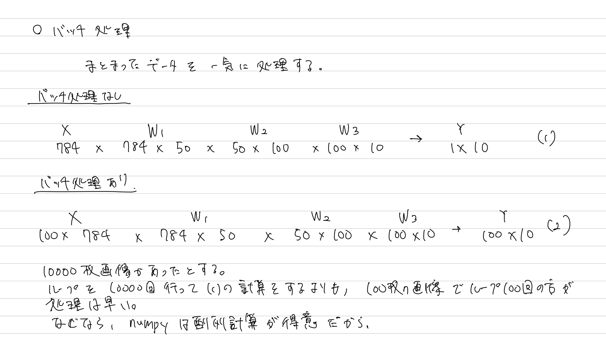

# 3章 ニューラルネットワーク
2章まででパーセプトロンについて理解した。
パーセプトロンは様々な関数を表現できるという可能性を秘めているが、パラメータ（重みやバイアス）を決定するのは面倒くさい。
その部分をコンピュータにやらせることできないかな？？

そこで登場するのが**ニューラルネットワーク**。

# 活性化関数
## パーセプトロンの復習
下のしきは、入力 $x_1$ と $x_2$ を受け取り、それに重み$\omega$を掛け合わせ、バイアス $b$ を加えた時の値が0以上か未満かを判断して、出力を得る。

$$
\begin{align}
y = 
\begin{cases}
0 & (b + \omega_1 x_1 + \omega_2 x_2 \leq 0) \\
1 & (b + \omega_1 x_1 + \omega_2 x_2 > 0)
\end{cases}
\end{align}
$$

今の状態における0との比較の部分を関数化してみる。

$$
\begin{align}
h(x) = 
\begin{cases}
0 & (x \leq 0) \\
1 & (x > 0)
\end{cases}
\end{align}
$$

入力 $x$ は、パラメータの処理を終えた値である。

このように入力信号の総和を出力信号に変換する関数を**活性化関数**とよぶ。

これまでのことを整理すると以下のような図になる。


> 「パーセプトロン」という言葉が指すアルゴリズムは、本書では厳密な統一がなされずに使われています。一般的に「単純パーセプトロン」といえば、それは単層のネットワークで、活性化関数にステップ関数（閾値を境にして出力が切り替わる関数）を使用したモデルを指します。「多層パーセプトロン」というと、それはニューラルネットワーク(sigmoid関数などを活性化函数とするネットワーク)を指すのが一般的。

## 様々な活性化関数
### シグモイド関数
以下の式で表される。

$$
\begin{align}
h(x) = \frac{1}{1 + e^{-x}}
\end{align}
$$

グラフにするとこんな感じ。


### ステップ関数
ステップ関数はこんな感じ。


### シグモイド関数とステップ関数の比較
シグモイド関数とステップ関数を比較してみる。


一番の特徴として、シグモイド関数は連続値、ステップ関数は0または1となっている。

また、両者ともに**非線形関数である**。
#### なぜ、非線形関数である必要があるのか。
例えば、活性化関数 $h(x)$ を以下のように定義する。（ $h(x)$ は線形関数）

$$
\begin{align}
h(x) = cx \ \ \  (cは任意の定数)
\end{align}
$$

この活性化関数を用いて3層のネットワークを構築したとする。
得られる $y(x)$ は以下の通りである。

$$
\begin{align}
y(x) = c \times c \times c \times x
\end{align}
$$

これって結局、 $c = c^3$ とした1層のネットワークと変わらない。（＝ 深くする意味がない）
層を深くすることで表現力をあげたいから、活性化関数は非線形関数を採用する。

### ReLU関数
最近、活性化函数として使われるようになってきたらしい。
以下の式で表される。

$$
\begin{align}
h(x) = 
\begin{cases}
x & (x > 0) \\
0 & (x \leq 0)
\end{cases}
\end{align}
$$

グラフは以下のようになる。


## 多次元配列の計算
入力から出力を得るフローについて、行列の計算が有用。


## 3層のニューラルネットワークの実装
より実践的なニューラルネットワークの実装を行う。
ここではフォワードの実装をする。
> フォワードとは入力値から出力値までの処理

以下のようなネットワークを実装する。


実装は`neuralnet_3.ipynb`

### 出力層の設計
ニューラルネットワークは、分類問題と回帰問題の両方に用いることができる。
一般的に、回帰問題では恒等関数を、分類問題ではソフトマックス関数を使う。
#### 恒等関数
入力をそのまま返す関数
```python
def identity_function(x):
    return x
```

#### ソフトマックス関数
数式にすると以下のようになる。

$$
\begin{align}
y_k = \frac{\exp(a_k)}{\sum_{i = 1}^{n}\exp({a_i})}
\end{align}
$$

みた感じ、確率みたいな値が出てきそう、、
```python
def softmax(a):
    exp_a = np.exp(a)
    sum_exp_a = np.sum(exp_a)
    y = exp_a / sum_exp_a

    return y
```
実装してみたけど、これだとまずいらしい。
例えば、以下の場合、
```python
a = np.array([1010, 1000, 990])
print(np.exp(a) / np.sum(np.exp(a)))
```
```python
[nan, nan, nan]
```
となる。
これは値がオーバーフローしてしまっていることを意味する。

この対策をするため、式(7)を以下のように変形する。

$$
\begin{align*}
y_k &= \frac{\exp(a_k)}{\sum_{i = 1}^{n}\exp({a_i})} \\
& = \frac{C \exp(a_k)}{C\sum_{i = 1}^{n}\exp({a_i})} \\
& =  \frac{\exp(a_k + \log C)}{\sum_{i = 1}^{n}\exp{(a_i + \log C)}} \\
& = \frac{\exp(a_k + C')}{\sum_{i = 1}^{n}\exp({a_i} + C')}
\end{align*}
$$

そして、 $C'$ の値を $\max(\mathbb{a})$ としてあげればオーバーフローを防ぐことができる。

改良版ソフトマックス関数
```python
def softmax(a):
    c = np.max(a)
    exp_a = np.exp(a - c)
    sum_exp_a = np.sum(exp_a)
    y = exp_a / sum_exp_a

    return y
```

>確率みたいな値が出てきそう、、
検証してみる。
```python
a = np.array([0.3, 2.9, 4.0])
y = softmax(a)
print(y)
# [0.01821127 0.24519181 0.73659691]

print(np.sum(y))
# 1.0
```
やはり、確率になっている。

## MNISTデータを用いた分類問題
`mnist.ipynb`で実装

### バッチ処理
まとまりのある入力データのことを**バッチ**とよぶ。
100枚の画像をまとめて処理するイメージ。
バッチの実装をしてみる。`mnist.ipynb`

