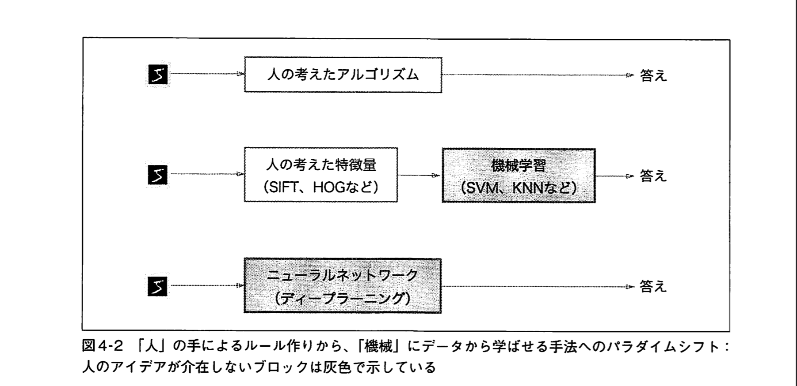
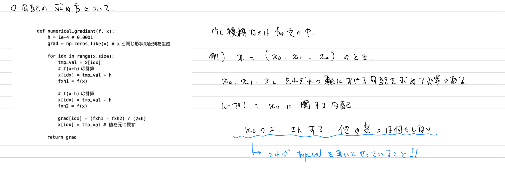
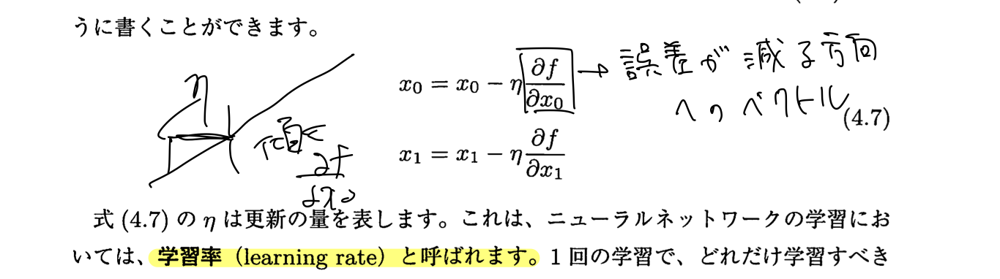
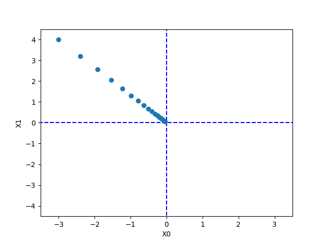

# ニューラルネットワークの学習
## 学習とは

訓練データから最適な重みパラメータの値を自動で獲得すること。

ニューラルネットワークでは損失関数という指標を用意し、それによって得られた値を可能な限り小さくしていくことを目標とする。

## データ駆動
画像分類において、以下のアプローチが考えられる。

1. 人間が、パラメータなどを設定する
2. 人間が画像を分類する際の着眼点（特徴量）を設定して、それに応じてコンピュータに分類させる
3. コンピュータが特徴量を独自に生み出し、分類する

ニューラルネットワークは3つ目のアプローチを行う。したがって人間の手が直接関わるのは、データのみである。



## 損失関数
ニューラルネットワークの学習における**指標**

ここでいう指標とは「正解とどのくらい離れているか。どのくらい間違っているか」を表す。 

### 2乗和誤差
損失関数の１つ。以下の式で表される。

$$
\begin{align}
E = \frac{1}{2} \sum_{k}(y_k - t_k)^2
\end{align}
$$

pythonで実装するとこんな感じかな

```python
def sum_squared_error(y, t):
    return 0.5 * np.sum((y - t) ** 2)
```

### 交差エントロピー誤差
損失関数の1つ。以下の式で表される。

$$
\begin{align}
E = - \sum_{k}t_k \log y_k
\end{align}
$$

pythonでの実装

```python
def cross_entropy_error(y, t):
    delta = 1e-7
    return -np.sum(t * np.log(y + delta))
```

## ミニバッチ学習
機械学習における学習とは、訓練データに対する損失関数を求め、その値をできるだけ小さくするようなパラメータを探し出すということである。
訓練データが100個くらいなら、全てのデータに対する損失関数を求め、その平均を算出することで学習における指標を用意することができる。
例えばデータが$N$個なら、以下のような式となる。

$$
E = -\frac{1}{N}\sum_{n}\sum_{k}t_{nk}\log{y_{nk}}
$$

しかし、$N$が巨大になった場合も同様なフローを実行できるかと言われたら難しい。
そこで、数あるデータのうちいくつか、例えば100枚を無作為に選び出して、その100枚を使って学習を行うという方法がある。その方法をミニバッチ学習という。

実装は`minibatch.ipynb`

## なぜ損失関数を設定するのか？
単純な疑問。認識精度を高くしたいのに、認識精度を指標とせず、損失関数を指標としている。

損失関数が減る方向にパラメータを調整するとは、現時点での微分（勾配）を求め、減る方向にパラメータを調整するということである。
認識精度を指標としないのは、この微分がほとんどの場所で0となってしまうからである。

なぜか？？

例を挙げて考える。
認識精度が32%のモデルがあるとする。
パラメータを少し調整したところで、そのニューラルネットワークが出す最終的な答え（確率が一番高いもの）が変わるとは考えにくい。
したがって、認識精度を指標にしても、パラメータの微小な変化に対応できないので、指標として扱うべきではない。
一方、損失関数はそのニューラルネットワークが出す答え関して、正解とどのくらい離れているか（誤差）を求めるので、ニューラルネットワークの出力そのものをベースとしてパラメータを調整することになる。
よって、パラメータの調整によって、出力の数値には必ず変化があると考えられるから、損失関数を指標として採用するべきである。

## 勾配の求め方に関するメモ


## 勾配法
損失関数において勾配を求め、損失関数が小さくなる方へパラメータを調整していく方法。

注意点として、勾配が指す方向が本当に最小値なのかどうか、本当に進むべき方向なのかは保証されない。
なぜなら損失関数は複雑であり、極小値や鞍点などが存在する場合があるためである。

ただ、勾配の方向が最小値でないとしても、その方向に進むことで関数の値を最も減らすことができる。

勾配法を数式で表してみると、以下の通りである。

$$
\begin{align*}
x_0 = x_0 - \eta \frac{\partial f}{\partial x_0} \\
x_1 = x_1 - \eta \frac{\partial f}{\partial x_1}
\end{align*}
$$



ニューラルネットワークの学習において、学習率の値を変更しながら、正しく学習できているかどうか、確認作業を行うのが一般的である。

pythonで実装してみる。

```python
def gradient_descent(f, init_x, lr=0.01, step_num=100):
    x = init_x
    for i in range(strp_num):
        grad = numerical_gradient(f, x)
        x -= lr * grad

    return x
```

 $f(x_0, x_1) = x_0^2 + x_1^2$ の最小値を勾配法によって求めてみる。
グラフにプロットすると以下のようになる



## ニューラルネットワークにおける勾配
重みと出力の関係を整理する。

重みを入力値に掛け合わせることで出力が得られる。そして損失関数はその出力から得られるので、
損失関数を$L$とし、重みを $\mathbb{W}$ とすると、勾配は $\frac{\partial L}{\partial \mathbb{W}}$ というふうに表すことができる。