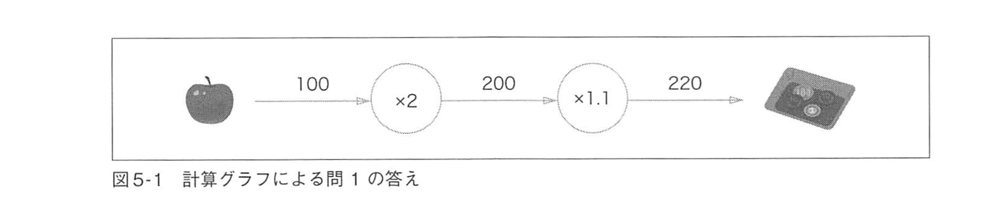
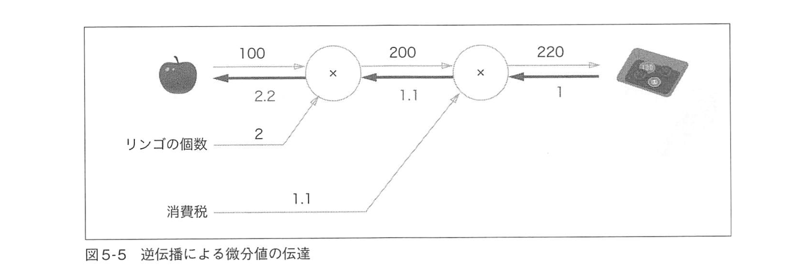
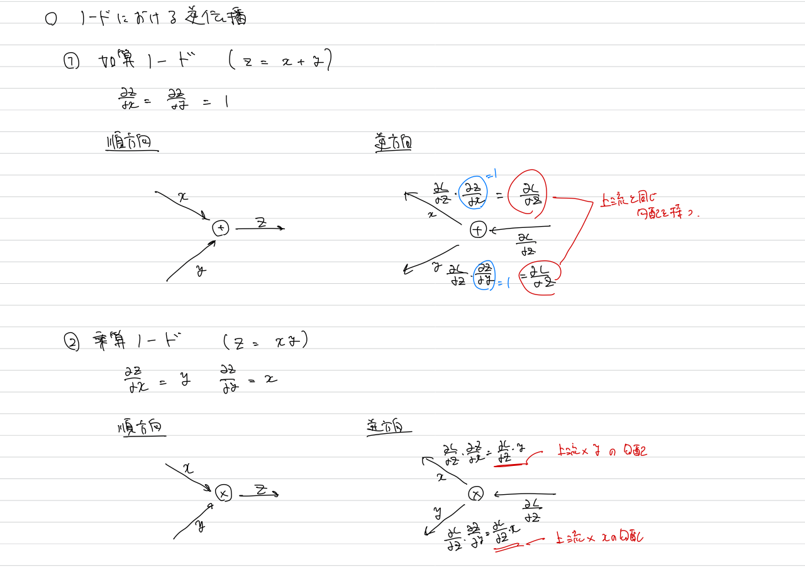

# 誤差逆伝播法
前のチャプターでは、重みパラメータの勾配を数値微分を用いて行なっていた。
本チャプターではパラメータの勾配の計算を効率よく行う「誤差逆伝播法」について学ぶ。

# 順伝播と逆伝播
以下の問題を考える。

> 太郎くんはスーパーで1個100円のリンゴを2個買いました。支払う金額を求めなさい。
ただし、消費税が10%適用されるものとします。

計算グラフで考えると、

となる。このように、計算を左から右へ進めていくステップを**順伝播**という。
一方、右から左、すなわち逆方向に計算を進めていくステップを**逆伝播**という。

# 計算グラフと微分
先ほどの例で、リンゴの値段が値上がりした場合、最終的な支払額にどのように影響するのか知りたいとする。つまり、リンゴの値段に関する支払額の微分を求めたいということ。リンゴの値段を $x$ 、支払額を $L$ とした場合、求めるのは $\frac{\partial L}{\partial x}$ である。計算グラフを用いるとその値は以下のように逆伝播を用いることで求められる。

逆伝播によって局所的な微分が「1 $\rightarrow$ 1.1 $\rightarrow$ 2.2」のように左に伝播している。今、リンゴの値段に関する支払額の微分を求めたが、消費税に対する支払額の微分なども求めることができる。計算グラフによって微分を求めることの利点は、「過去に求めた微分を使って今求めたい微分を求めることができる」というところにある。
これはアルゴリズムでの部分和に近い気がした。それぞれの値について1から計算するのではなく、一度求めた数値を流用して、新たな数値を計算している。

## ノードにおける逆伝播

今議論したものと本の例をpythonで実装してみる。`layer.ipynb`